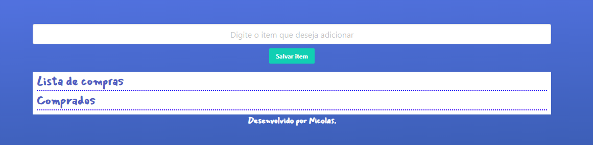

# 🛒 Lista de Compras Web

Uma aplicação web simples para gerenciar sua lista de compras, feita com HTML, CSS e JavaScript puro, sem dependências externas.

## ✨ Funcionalidades

- ✅ Adicionar itens à lista
- ❌ Remover itens da lista
- ✏️ Marcar itens como comprados
- 💾 Armazenamento local (LocalStorage) — sua lista é salva mesmo após fechar o navegador

## 📸 Demonstração


## 🚀 Como usar

1. Clone este repositório:

```bash
git clone https://github.com/nicolasconinck/lista-de-compras.git


Abra o arquivo index.html no navegador:

```bash
cd lista-de-compras-js
start index.html
Ou simplesmente abra o index.html com duplo clique no seu navegador preferido.

🔧 Tecnologias Utilizadas
HTML5

CSS3

JavaScript (ES6+)

LocalStorage

💡 Possíveis melhorias
 Permitir editar itens

 Categorias de produtos

 Ordenar por nome ou status

 Integração com backend para múltiplos usuários

🧑‍💻 Autor